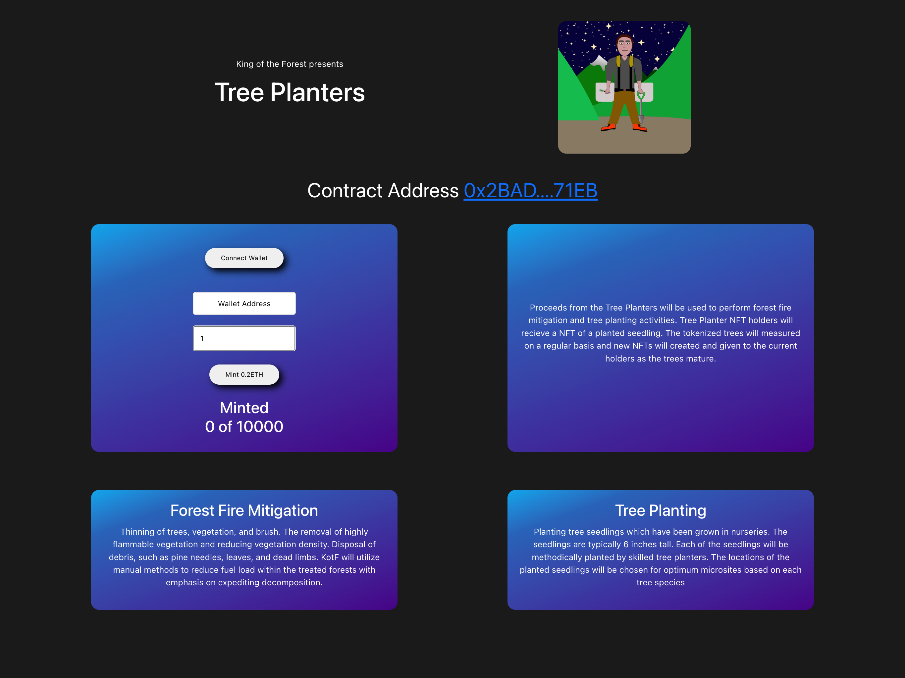

# NFT Minting App
    
## Description:
A Web3 Dapp for minting a collection of 10,000 unique Nfts
---
Contract Address [0x2BAD350AA80c70f187AdC2834F790EdfD99771EB](https://etherscan.io/address/0x2BAD350AA80c70f187AdC2834F790EdfD99771EB)

### [Live Site](https://kingoftheforest-treeplanters.netlify.app/)

## Table of contents
* [Description](#description)
* [Usage](#usage)
* [Screenshots](#screenshots)
* [Technology](#technology)
* [Contributing](#contributing)
* [Questions](#questions)
## Usage

This app is a website that allows users to mint my custom NFTs
  

---

## Screenshots 

## Technology

Solidity, Ganache, React, Ethers, Web3, Bootstrap

## Contributing
if you would like to become a collaberator on this project please feel free to look at the issues tab or send me an email.

## Questions
For questions please contact: 
---
James at [james.edward.pritchard@gmail.com](mailto:james.edward.pritchard@gmail.com)
---
Github Profile: 
---
[James Pritchard](https://github.com/SuedePritch)
---